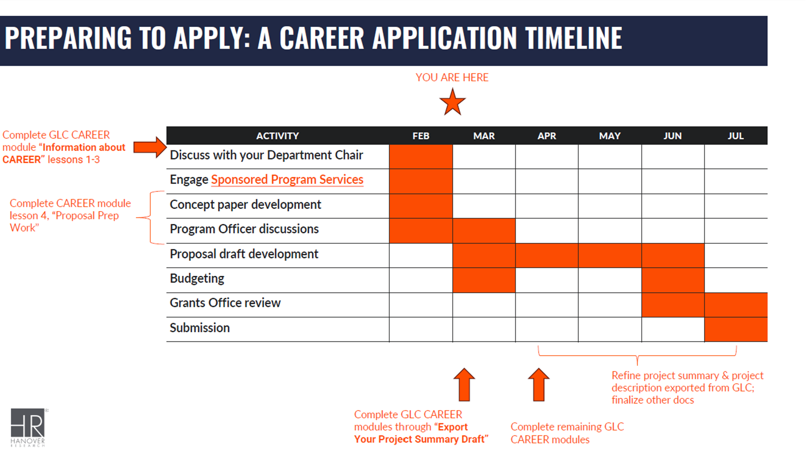

# Grant Writing services

[Office of the Vice President for Research (OVPR) Resource Library](https://ovpr.uconn.edu/services/research-development/resource-library/)

[COE Research Resources](https://uconn.sharepoint.com/:u:/r/sites/EngineeringIntranet/SitePages/Research-Resources(1).aspx?csf=1&web=1&e=STyDgC)

# NSF Career Awards

NSF CAREER CoE RD Support: 
1. Click the following link: [Grants Learning
   Center](https://glc.hanoverresearch.com/register?utm_medium=email&_hsenc=p2ANqtz-9v1ZNs5irg8LFqim8nu0a1IkVz2y6yZuuhNSPO7OTYWUK-MH33UGZH5OiQGODBhJZuS3SEqaT7D_fOyZubUUCFUKa8Xg&_hsmi=214570220&utm_content=214570220&utm_source=hs_email)
2. Add your name, email, and preferred password 
3. Enter referral code: RollSkies (institutional license, free to you)
Feel free to reply or DM for any questions/concerns.

[20250612 NSF CAREER webinar on engineering education research proposals](https://www.nsf.gov/events/nsf-career-webinar-engineering-education-research-proposals?utm_medium=email&utm_source=govdelivery)

[CAREER Proposal Submission Logistics Webinar](https://www.nsf.gov/events/career-proposal-submission-logistics-webinar-0?utm_medium=email&utm_source=govdelivery)

